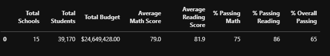

# School District Analysis

## Overview of Project
The purpose of this project was to remove student scores from Thomas High School 9th graders and determine if and how this removal affects the school district's data analysis.

## Results
__How is the district summary affected?__

##
##