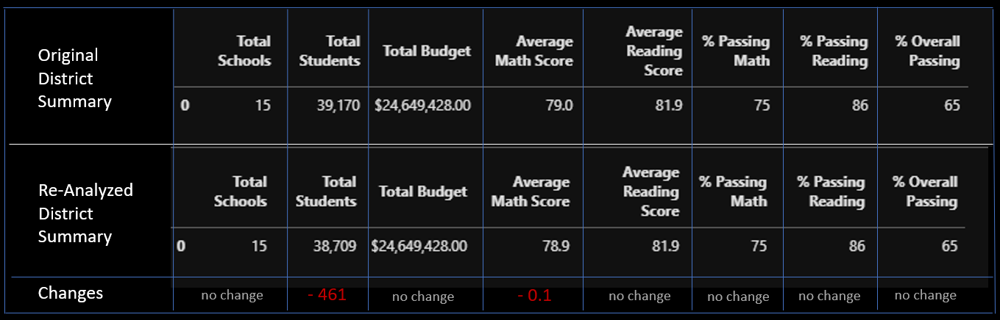

# School District Analysis

## Overview of Project
The purpose of this project was to remove student scores from Thomas High School 9th graders and determine if and how this removal affects the school district's data analysis.

## Results
### __How is the district summary affected?__



- In the table above is a comparison of the original district summary versus the re-analyzed district summary. Notably, the number of total students *decreased* by **461** after removing the affected scores from Thomas High School 9th grade students. Aside from the number of students, the rest of the data was minimally affected.

### __How is the school summary affected?__
_Original School Summary_


_Re-analyzed School Summary_    


- The school summaries don't have any significant differences.

### __How was Thomas High School's performance affected relative to other schools after changes?__
_Original School Summary_


_Re-analyzed School Summary_

   
- Comparing the original 'Top 5 Schools' to the re-analyzed version, it is apparent that Thomas High School's performance with respect to other schools was unaffected- the position of each school on the list remained the same. So while there were some minor changes to score averages and passing percentages, they weren't significant enough to alter the school positions.
        
### __How does replacing the 9th grade scores affect the following__:

***Math and reading scores by grade*** 
  
_Original_


      
_Re-analyzed_


    
   - The math and reading scores, as expected, are unaffected with the exception of the missing Thomas High 9th grade scores labeled as 'nan'. 
    
        
***Scores by school spending***

_Original_


_Re-analyzed_    


- The scores based on school size were not significantly impacted by removal of Thomas High 9th grade student scores.
    
    
    
***Scores by school size***

 _Original_
 
 
_Re-analyzed_   


   - The scores based on school size were not significantly impacted by removal of Thomas High 9th grade student scores.
    
***Scores by school type***

_Original_


_Re-analyzed_  


   - The scores based on school type were not significantly impacted by removal of Thomas High 9th grade student scores.
    
## Summary
- Overall, the removal of Thomas High School's 9th grade student scores had little impact on school district metrics. The minor differences in score calculations were undetectable after formatting decimals appropriately. 

***Four changes:***
1. The number of total students in the district summary was decreased by 461, which accounts for the removed Thomas High School 9th grade students.

2. In the District Summary DataFrame, the Average Math Score was *decreased* by **0.1**.

3. In the ```per_school_summary``` dataframe, Thomas High School's **Average Reading Score** actually *increased* by 0.1 after the re-analysis.

4. In the ```math_scores_by_grade``` and ```reading_scores_by_grade``` dataframes, the values for all Thomas High School 9th grade student scores were changed to ```nan```.


